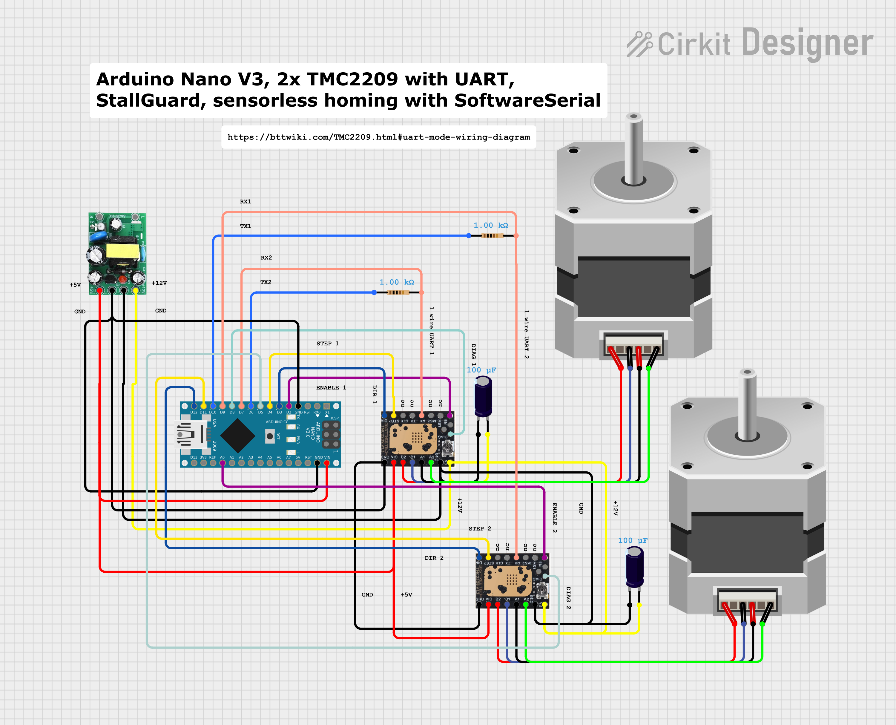

# TMC2209 Dual Motor Controller for Arduino Nano

[](https://arduino.cc/)
[](https://www.trinamic.com/products/integrated-circuits/details/tmc2209/)
[](LICENSE)

## Overview

This project enables **dual TMC2209 stepper driver control on Arduino Nano** - something typically requiring an Arduino Mega! It uses an SoftwareSerial UART switching mechanism to provide separate communication channels for each driver while maintaining full functionality.

## Key Features

- **Dual TMC2209 control on Arduino Nano**
- **UART switching system** for reliable separate communication
- **Stallguard-based sensorless homing** for both motors
- **Real-time motor diagnostics** and control
- **Memory-optimized** for Arduino Nano constraints (< 2048 bytes RAM)
- **Full microstep flexibility** (1-256 steps) on both drivers
- **Hardware interrupt support** for fast stall detection

## Hardware Requirements

### Required Components
- **Arduino Nano V3** (tested) or Arduino Uno
- **2x TMC2209 stepper drivers** (BIGTREETECH V1.3 tested)
- **2x Stepper motors** (NEMA 17 recommended)
- **Power supply** (12-24V for motors, 5V for Arduino)

### Pin Configuration

#### Motor A (First TMC2209)
```
EN_PIN     → D2    (Enable)
DIR_PIN    → D3    (Direction)  
STEP_PIN   → D4    (Step)
SW_RX      → D7    (SoftwareSerial RX → TMC2209 TX)
SW_TX      → D6    (SoftwareSerial TX → TMC2209 RX)
DIAG_PIN   → D8    (DIAG1 from TMC2209, interrupt capable)
```

#### Motor B (Second TMC2209)
```
EN2_PIN    → A0    (Enable)
DIR2_PIN   → D12   (Direction)
STEP2_PIN  → D11   (Step)  
SW2_RX     → D9    (SoftwareSerial RX → TMC2209 TX)
SW2_TX     → D10   (SoftwareSerial TX → TMC2209 RX)
DIAG2_PIN  → D5    (DIAG1 from TMC2209, interrupt capable)
```

#### Available Pins
- **D13** - Free for additional sensors/LEDs
- **A1, A2, A3** - Free for analog inputs

### Circuit Diagram



**Interactive Circuit**: [View and edit on Cirkit Designer](https://app.cirkitdesigner.com/project/2bf852c7-9e8d-40d1-a5bd-bcb2e40b7dd5)

## Installation

### 1. Required Libraries
Install these libraries through Arduino IDE Library Manager:
```
- TMCStepper by teemuatlut
- AccelStepper by Mike McCauley  
- SoftwareSerial (included with Arduino IDE)
```

### 2. Hardware Setup
1. Connect TMC2209 drivers according to pin configuration above
2. Ensure proper power supply connections
3. Connect DIAG pins for stallguard functionality
4. Set TMC2209 drivers to UART mode (MS1/MS2 pins)

### 3. Upload Code
1. Download `TMC2209_Dual_UART_Controller.ino`
2. Open in Arduino IDE
3. Select "Arduino Nano" as board
4. Upload to your Arduino

## Usage

### Serial Commands
Send these commands via Serial Monitor (115200 baud):

| Command | Function |
|---------|----------|
| `a<number>` | Move Motor A to position (e.g., `a1000`) |
| `A` | Home Motor A using stallguard |
| `b<number>` | Move Motor B to position (e.g., `b500`) |
| `B` | Home Motor B using stallguard |
| `t` | Test Motor B (10 revolutions forward) |
| `d` | Display driver diagnostics |
| `+` | Increase Motor B current (+100mA) |
| `-` | Decrease Motor B current (-100mA) |

### Example Usage
```
A          // Home Motor A
B          // Home Motor B  
a2000      // Move Motor A to position 2000
b1500      // Move Motor B to position 1500
d          // Show diagnostics
```

## Technical Innovation

### UART Switching Mechanism
The breakthrough of this project is the **UART switching system** that allows:
- Separate communication channels for each TMC2209
- No address conflicts or shared communication issues
- Full register access for both drivers
- Reliable stallguard operation on both motors

### Memory Optimization
Special techniques used for Arduino Nano compatibility:
- `F()` macros for string storage in FLASH memory
- Efficient variable usage
- Optimized communication timing
- Total RAM usage < 2048 bytes

## Performance

- **Positioning accuracy**: ±1 step
- **Stallguard sensitivity**: Configurable (STALLA_VALUE, STALLB_VALUE)
- **Communication speed**: 115200 baud per driver
- **Interrupt response**: < 1ms for stall detection
- **Memory usage**: ~1950 bytes RAM, ~14KB FLASH

## Configuration

### Motor Current Settings
```cpp
#define MOTOR_A_CURRENT 700  // Motor A current in mA
#define MOTOR_B_CURRENT 700  // Motor B current in mA
```

### Stallguard Sensitivity
```cpp
#define STALLA_VALUE 5   // Motor A stallguard (0=sensitive, 255=insensitive)
#define STALLB_VALUE 10  // Motor B stallguard
```

### Steps per Revolution
```cpp
constexpr uint32_t steps_per_round = 200*(60/16); // For belt/pulley system
```

## Troubleshooting

### Common Issues

**Motor not moving:**
- Check enable pin connections (should be LOW for enabled)
- Verify power supply connections
- Ensure proper UART wiring

**Stallguard not working:**
- Check DIAG pin connections
- Adjust stallguard sensitivity values
- Verify motor current settings

**Communication errors:**
- Check SoftwareSerial pin connections
- Ensure TMC2209 is in UART mode
- Verify baud rate (115200)

### Debug Output
Enable verbose output to diagnose issues:
```
A SG: 45    // Stallguard values for Motor A
B SG: 23    // Stallguard values for Motor B
```

## Applications

Perfect for projects requiring:
- **Dual-axis control** (X/Y positioning, pan/tilt)
- **Sensorless homing** systems
- **Precise positioning** with stallguard feedback
- **Arduino Nano-based** compact designs
- **Silent operation** with TMC2209 StealthChop

## Contributing

Contributions welcome! Areas for improvement:
- Additional motor support (3+ motors)
- Web interface integration
- CNC/3D printer applications
- Alternative Arduino board support

## License

This project is licensed under the MIT License - see the [LICENSE](LICENSE) file for details.

## Acknowledgments

- **Teemu Mäntykallio** - Original TMCStepper library concept
- **TMC2209 Community** - Hardware insights and testing
- **Arduino Community** - SoftwareSerial optimization techniques

## Support

- **Author**: Kletternaut
- **Issues**: Create GitHub issue for bugs/features
- **Discussions**: Use GitHub Discussions for questions
